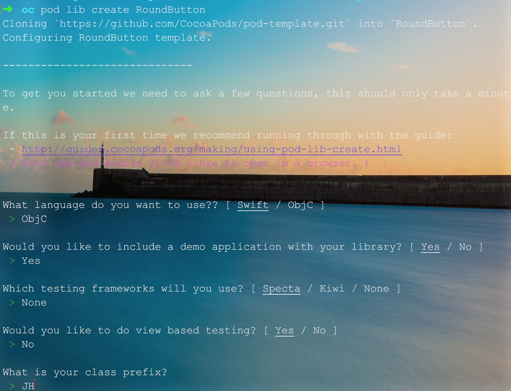
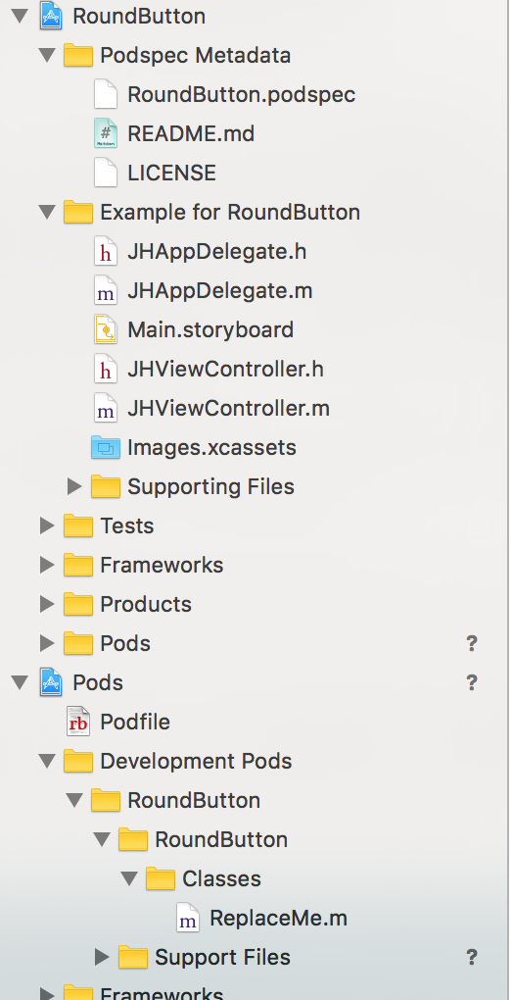
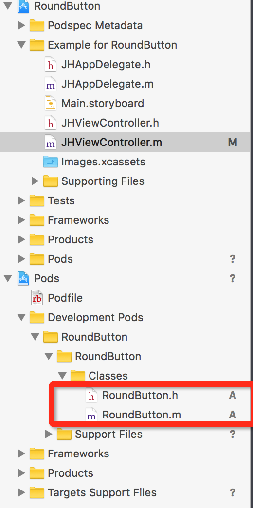
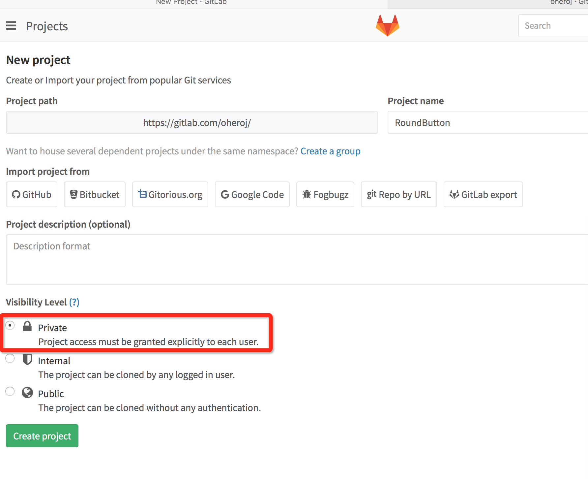
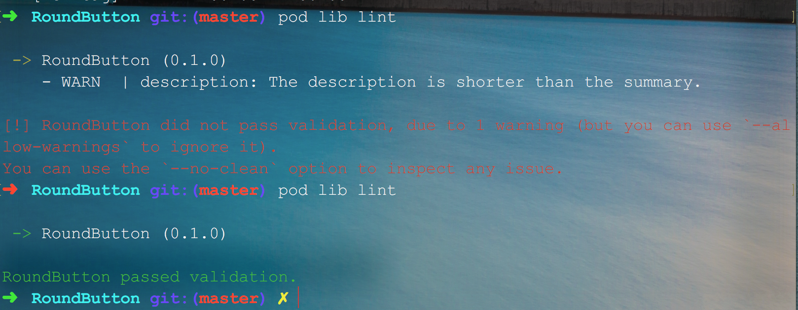
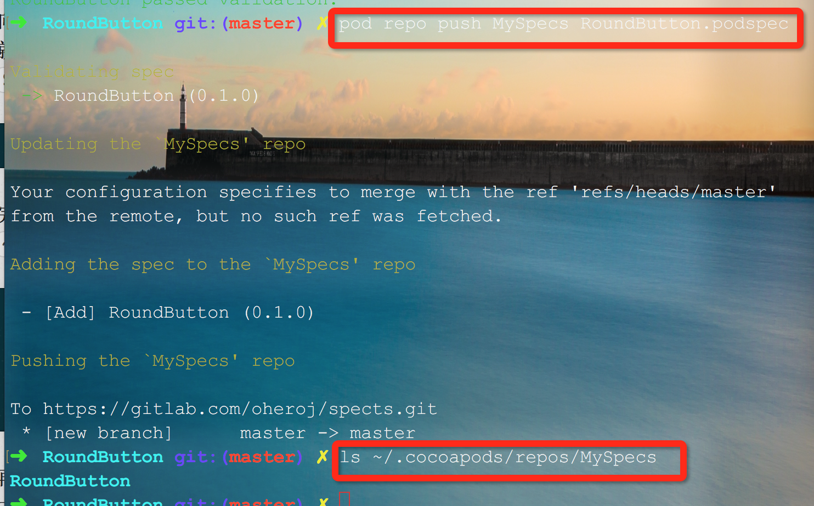

参考：
<a href="http://blog.devzeng.com/blog/ios-cocoapods-private-repo.html">在iOS项目中使用CocoaPods私有库</a>
#1.创建并设置一个私有的Spec Repo
<pre><code>
pod repo add MySpecs https://gitlab.com/Dk/spects.git
</code></pre>
验证是否成功的话
<pre><code>
cd ~/.cocoapods/repos/MySpecs
</code></pre>

 

#2. 创建Pod所需要的项目工程文件， 并且有可访问的项目版本控制地址

#3. 创建Pod所对应的podspec文件
一般情况下2，3 两步骤是在一起的， 使用
<pre><code>
pod lib create RoundButton
</code></pre>

 
 

接下来就是在pod文件夹中添加文件和资源， 并配置podspec文件。

将代码推送到远端:
<pre><code>
git add .
git commit -s -m "First Commit of Lib"
</code></pre>

这个时候你在gitlab上创建个项目：

将本地代码与远程库关联：
<pre><code>
git remote add origin git@gitlab.com:CallMeDK/RoundButton.git #添加远端仓库
git push origin master # 提交到远端仓库
</code></pre>

这里我们也会遇到一个问题就是 git 提交人的信息有问题，默认提交者为你设置的全局的git的ueser， 所以这个时候就得改名字了， 比如我这边要改为 CallMeDK , 然后邮箱改为gmail邮箱。

有这么一段脚本可以<a href="https://git-scm.com/book/zh/v2/Git-%E5%B7%A5%E5%85%B7-%E9%87%8D%E5%86%99%E5%8E%86%E5%8F%B2">参考执行</a>

有这么个脚本 change.sh, 里面的内容是:
<pre><code>
git filter-branch --env-filter '

OLD_EMAIL="1814345797@qq.com"

CORRECT_NAME="Dk"

CORRECT_EMAIL="CallMeDk@gmail.com"

if [ "$GIT_COMMITTER_EMAIL" = "$OLD_EMAIL" ]

then

    export GIT_COMMITTER_NAME="$CORRECT_NAME"

    export GIT_COMMITTER_EMAIL="$CORRECT_EMAIL"

fi

if [ "$GIT_AUTHOR_EMAIL" = "$OLD_EMAIL" ]

then

    export GIT_AUTHOR_NAME="$CORRECT_NAME"

    export GIT_AUTHOR_EMAIL="$CORRECT_EMAIL"

fi

' --tag-name-filter cat -- --branches --tags
</code></pre>

这个时候你直接替换相应的内容，然后执行 sh change.sh

---
这里需要注意的是每当你向Pod中添加了新的文件或者以后更新了podspec的版本都需要重新执行一遍pod update命令

接下来就是编辑podspec文件了
<pre><code>
Pod::Spec.new do |s|

  s.name             = 'RoundButton'

  s.version          = '0.1.0'

  s.summary          = 'A Custom Round Button of Button.'

  s.description      = <<-DESC

创建一个带有圆角的UIButton, 并且用block封装回调  DESC

  s.homepage         = 'https://gitlab.com/CallMeDK/RoundButton'

  # s.screenshots     = 'www.example.com/screenshots_1', 'www.example.com/screenshots_2'

  s.license          = { :type => 'MIT', :file => 'LICENSE' }

  s.author           = { 'CallMeDK' => 'CallMeDK@gmail.com' }

  s.source           = { :git => 'https://gitlab.com/CallMeDK/RoundButton.git', :tag => s.version.to_s }

  # s.social_media_url = 'https://twitter.com/<TWITTER_USERNAME>'

  s.ios.deployment_target = '8.0'

  s.source_files = 'RoundButton/Classes/**/*'

  # s.resource_bundles = {

  #   'RoundButton' => ['RoundButton/Assets/*.png']

  # }

  # s.public_header_files = 'Pod/Classes/**/*.h'

  # s.frameworks = 'UIKit', 'MapKit'

  # s.dependency 'AFNetworking', '~> 2.3'
  
end

</code></pre>

进行提交，并且打tag

这里有个地方可以题一下，如果你的 pod 库是依赖系统的默写 lib 的时候，如 libz, 那我们要怎么在 podspec 说明呢？

<pre><code>
# spec.libraries = 'xml2', 'z'

spec.ios.library = 'z'
</code></pre>

涉及到的字段可以到 <a href="http://guides.cocoapods.org/syntax/podspec.html#specification">官方文档</a> 查阅

因为podspec文件中获取Git版本控制的项目还需要tag号，所以我们要打上一个tag

<pre><code>
git commit -a -m "podspec modif"

git push origin master

git tag -m "first release" 0.1.0

git push --tags
</code></pre>

#4.本地测试配置好的podsepc文件是否可用
编辑完podspec文件后，需要验证一下这个文件是否可用，如果有任何WARNING或者ERROR都是不可以的，它就不能被添加到Spec Repo中，不过xcode的WARNING是可以存在的，验证需要执行一下命令
<pre><code>
pod lib lint
</code></pre>

 

如果在验证的时候是因为代码上的 warings 的时候，可以考虑使用
<pre><code>
pod lib lint --allow-warnings
</code></pre>

#创建podspec 文件(此步骤是对有现存项目的)

如果有现成项目的话， 我们就需要给这个项目创建个podspec文件
<pre><code>
pod sepc create RoundButton git@CallMeDK/RoundButton.git
</code></pre>

执行完之后，就创建了一个podspec文件，他其中会包含很多内容，可以按照我之前介绍的进行编辑，没用的删掉。编辑完成之后使用验证命令验证一下.

#5.向私有的Spec Repo 中提交 podsepc
<pre><code>
pod repo push MySpecs RoundButton.podspec
</code></pre>

 

<pre><code>
pod search RoundButton
</code></pre>

#6. 在个人项目中的Podfile中增加刚刚制作好的Pod使用
在其他项目中使用的时候, 在podfile中添加如下：
<pre><code>
source 'https://github.com/CocoaPods/Specs.git' #公有库

source 'https://gitlab.com/CallMeDK/spects.git'

platform :ios, "8.0"

target 'SepcPodDemo' do

pod 'RoundButton', '~> 0.1.0'

end

</code></pre>
然后执行pod install 即可

#7. 更新维护podspec
<h1>版本规范（版本tag）</h1>
<h2>major.minor.patch</h2>
App主项目依赖 pod 'AFNetworking', '~> 3.1.0'
<ul>
<li>修改bug和一些其他不重要修改（修改README，Format等），增加patch版本号。用户可以放心升级。</li>
<li>曾加功能并且向前兼容，增加minor版本号。用户可以考虑升级。（推荐升级）
</li>
<li>不向前兼容或重大修改或重构，增加major版本号。用户应当慎重决定是否升级。
</li>
<li>当major为0时，表示该库为beta版本。不是稳定版本，所以会经常修改，并很容易造成向前不兼容的情况。开发者需要认真评估major版本号。 此时发生向前不兼容的情况，开发者应当升级minor版本号。其他同上面的规范。
</li>
</ul>
<h1>维护、增加新功能</h1>
将源文件添加到Pod/Classes中， 在测试项目里pod update一下， 写代码验证无误之后，就可以将这个工程 push 到远端仓库， 并且打上新的 tag， tag 号遵从上面的版本规范来制定。

然后修改podspec上的s.version为我们的 tag 号。最后再次使用pod lib lint验证编辑好的podsepc文件，没有自身的WARNING或者ERROR之后，就可以再次提交到Spec Repo中了，命令跟之前是一样的

<pre><code>
pod repo push MySpecs RoundButton.podspec
</code></pre>

之后再次到~/.cocoapods/repos/MySpecs目录下查看 升级信息

<h1>删除本地一个私有Spec Repo
</h1>
<pre><code>
pod repo remove MySpecs
</code></pre>

<h1>删除私有Spec Repo某一个podspec</h1>
<pre><code>
cd ~/.cocoapods/repos/MySpecs

rm -rf RoundButton

git commit -a -m "Feat: RoundButton podspec"

git push origin master
</code></pre>

#8.参考文献
<ol>
<li><a href="http://guides.cocoapods.org/making/private-cocoapods.html">Private Pods</a></li>
<li><a href="http://blog.grio.com/2014/11/creating-a-private-cocoapod.html">Creating a Private CocoaPod</a></li>
<li><a href="https://objectpartners.com/2014/06/25/developing-private-in-house-libraries-with-cocoapods/">Developing Private In-House Libraries with CocoaPods</a></li>
<li><a href="http://blog.wtlucky.com/blog/2015/02/26/create-private-podspec/">使用Cocoapods创建私有podspec</a></li>
<li><a href="http://www.pluto-y.com/cocoapod-private-pods-and-module-manager/">Cocoapods系列教程(三)——私有库管理和模块化管理</a></li>
</ol>

