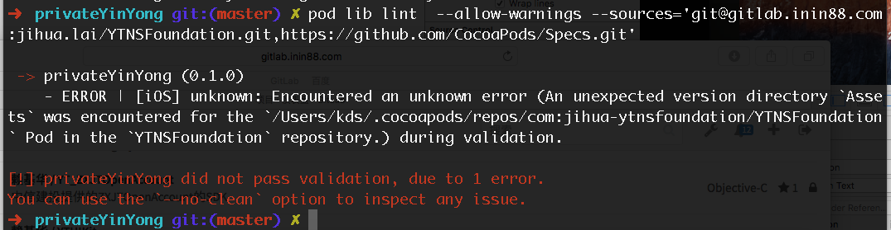
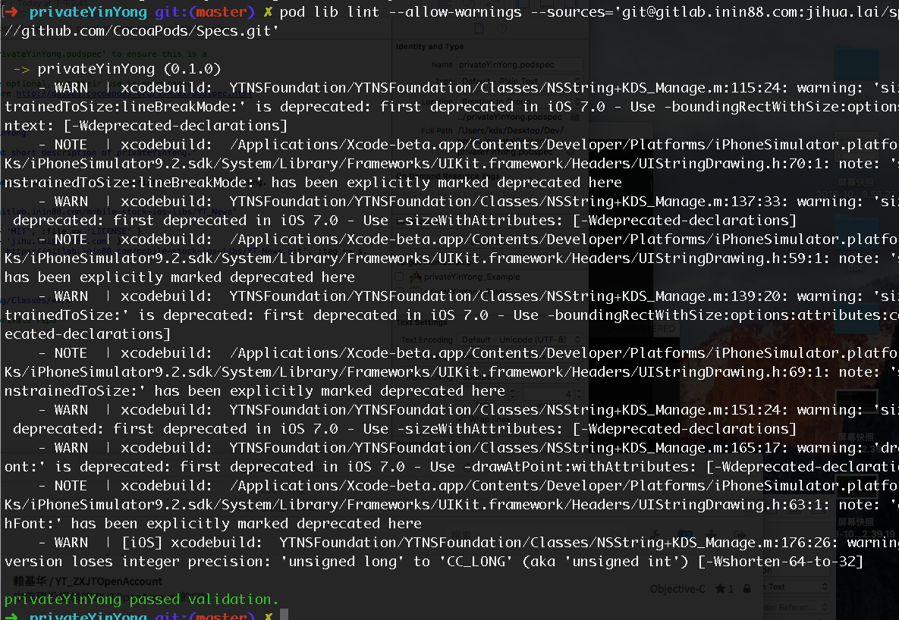

#Pod 私有库依赖私有库

一般，在组件化之路上，不可避免的会用到私有库中引用私有库， 即

s.dependency “私有库”

1、首先要简单说下pod install 的流程

终端运行 pod install后，会默认从github上搜索公开库的，因此，我们需要在PodFile上指明我们的私有库的地址，在PodFile 的顶上添加如下代码：

source 'https://github.com/CocoaPods/Specs.git' # 这个是github上公有库的地址，没有这个，pod就不会去公有库查询，就不能下载公有库的东西

source '私有库地址'，可以放多个source

2、前面的步骤基本一致：

1）创建远程仓库

2）创建并编辑 .podspec 文件

3）pod repo add #repo名# #远程仓库地址，如：http://git.xxxxx/xx/test.git#

4)验证 pod lib lint

3、验证通过

pod spec lint --sources='http://git.#私有仓库地址#,https://github.com/CocoaPods/Specs' ， 这个是对于验证的问题。

核心就在这了，不然会报找不到repo的错误。

##Pod私有库依赖pod私有库的处理过程及一些问题：
为了进一步组件化，我们现在把组件划分了为： 基础组件【C】和业务组件【B】，那么必然会有业务组件依赖与基础组件，那么就有 私有pod 依赖另一个私有pod.

假设B是业务组件，YTNSFoundation是基础组件，那么在B的podspec文件中

<pre><code>
Pod::Spec.new do |s|

  s.name             = 'B'

  s.version          = '0.1.0'

  s.summary          = 'desc about short description of B.'

  s.description      = <<-DESC

Add long description of the pod here.A desc about short description of B.

                       DESC

  s.homepage         = 'https://gitlab.inin88.com/mobile-stock-ios-libs/YT_News'

  s.license          = { :type => 'MIT', :file => 'LICENSE' }

  s.author           = { 'kds' => 'jihu.lai@inin88.com' }

  s.source           = { :git => 'https://gitlab.inin88.com/mobile-stock-ios-libs/YT_News.git', :tag => s.version.to_s }

  s.ios.deployment_target = '7.0'

  s.source_files = 'B/Classes/**/*'

  s.dependency 'AFNetworking'  # 公有

  s.dependency 'YTNSFoundation' # 私有

end
</code></pre>

我们可以很容易地设置依赖

<pre><code>
s.dependency 'YTNSFoundation' # 私有
</code></pre>

但是B怎么知道YTNSFoundation是私有的？我们第一反应就是

<pre><code>
s.dependency 'YTNSFoundation', '~> 0.1.0' , :git => 'git@gitlab.inin88.com:xx/YTNSFoundation.git'
</code></pre>

梦想很美好，现实很残酷，cocoapods 并没有这么友善。顶多给你

<pre><code>
s.dependency 'YTNSFoundation', '~> 0.1.0'
</code></pre>

那怎么办？办法还是有的：
要想组件B的spec通过，可以使用：
<pre><code>
pod lib lint --no-clean --allow-warnings --sources='git@gitlab.inin88.com:jxx/YTNSFoundation.git,https://github.com/CocoaPods/Specs'
</code></pre>

然而，然而，终究不能如愿，执行上面的代码后：





踩坑无数后，发现用这个神奇的通过了

<pre><code>
pod lib lint --allow-warnings --sources='git@gitlab.inin88.com:jxx/specs.git,https://github.com/CocoaPods/Specs.git'
</code></pre>




那么这个'git@gitlab.inin88.com:xx/specs.git'是神马
这个就是在初期制作的统一管理pod私有库的路径。

但是为什么这个路径就可以验证通过？

sources是干什么的？

##Spec Repo ？

1.我们来谈https://github.com/CocoaPods/Specs.git

他是所有Pods的一个索引，就是一个容器,所有公开的Pods都在里面，他实际上是一个Git仓库 remote端在github上，但是当你使用了cocoapods后会被clone到本地的~/.cocoapods/repos目录下， 可以进入到这个目录看到master文件夹就是这个官方的Spec Repo.这个master目录结构 是这样子的:

<pre>
```

.

├── Specs

    └── [SPEC_NAME]

        └── [VERSION]

            └── [SPEC_NAME].podspec

```
</pre>

依葫芦画瓢，那么就有了我们私有的Spec Repo：git@gitlab.inin88.com:xxx/specs.git。

如果不知如何制作，请移步到  (1)私有pod创建.md

理清了这些概念，那么为什么我们直接填私有库的路径就有问题，这个我现在也无从知晓


##那么B的demo如何进行？
修改podfile文件

<pre><code>
source 'git@gitlab.inin88.com:xx/specs.git'

source 'https://github.com/CocoaPods/Specs.git'

target 'privateYinYong_Example' do

  pod 'privateYinYong', :path => '../'

  target 'privateYinYong_Tests' do

    inherit! :search_paths


  end

end
</code></pre>

然后执行 pod update --verbose --no-repo-update.


##那么B组件的使用

使用跟使用'YTNSFoundation',区别

<pre><code>
source 'https://github.com/CocoaPods/Specs.git'

source 'https://gitlab.inin88.com/xx/specs.git'

target 'TestYingYong' do

  pod "privateYinYong", :git => "git@gitlab.inin88.com:xx/YT_Test.git"

end
</code></pre>

除了指定git路径，必须要写上

<pre><code>
source 'https://gitlab.inin88.com/xx/specs.git'
</code></pre>

不然报找不到 YTNSFoundation.


